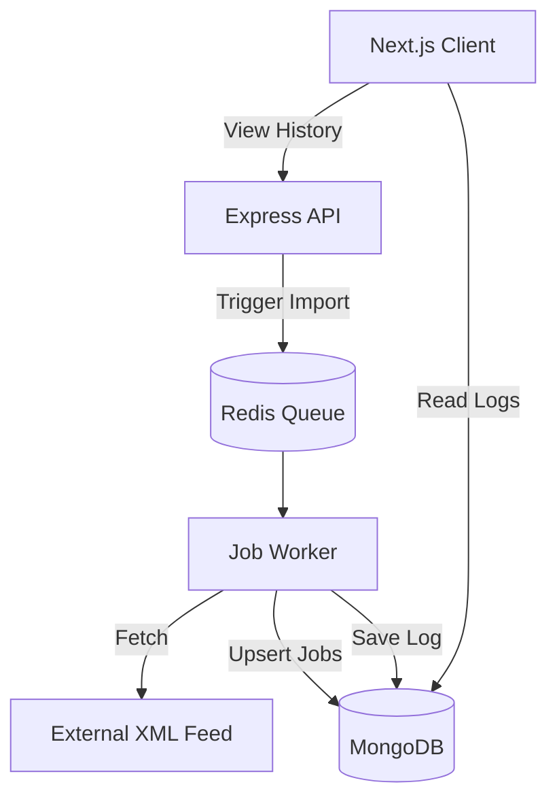

# System Architecture

## Overview
The Scalable Job Importer is designed to ingest job data from external XML feeds, process them asynchronously using a reliable queue system, and store them in a MongoDB database. An Admin UI provides visibility into the import history.

## Technology Stack
- **Backend**: Node.js, Express, TypeScript (for type safety and maintainability).
- **Database**: MongoDB (Mongoose) - ideal for storing flexible job data.
- **Queue**: Redis + BullMQ - ensures reliable processing, retry logic, and concurrency control.
- **Frontend**: Next.js - React framework for a performance-optimized Admin Dashboard.

## Data Flow
1.  **Trigger**: User (or Cron) triggers an import for a specific Feed URL.
2.  **Queue**: The Feed URL is pushed to the `ImportQueue`.
3.  **Worker**:
    -   Picks up the job from `ImportQueue`.
    -   Fetches the XML from the URL.
    -   Parses XML to JSON.
    -   Iterates through job records.
    -   **Upsert Logic**: Checks if a job (by unique ID/Link) exists:
        -   If yes -> Update.
        -   If no -> Insert.
    -   Tracks statistics (New, Updated, Failed).
4.  **Logging**: Worker saves an `ImportLog` document in MongoDB with the run statistics.
5.  **UI**: Frontend fetches `ImportLog` data to display the history table.

## Scalability Considerations
- **Queue-Based**: Decouples fetching from the API trigger. Allows horizontal scaling of workers if load increases.
- **Bulk Operations**: We will use MongoDB `bulkWrite` for efficient batched upserts to handle high throughput (aiming for 1M+ records handling capability).
- **Streams**: For very large XML feeds, we can implement streaming XML parsing (using `sax` or `xml-stream`) to avoid memory overflows, rather than loading the whole file into RAM. (Start with `xml2js` for simplicity, switch to stream if needed).

## Component Diagram

## Directory Structure
- `client/`: Next.js Application
- `server/`: Express Application
- `docs/`: Documentation
